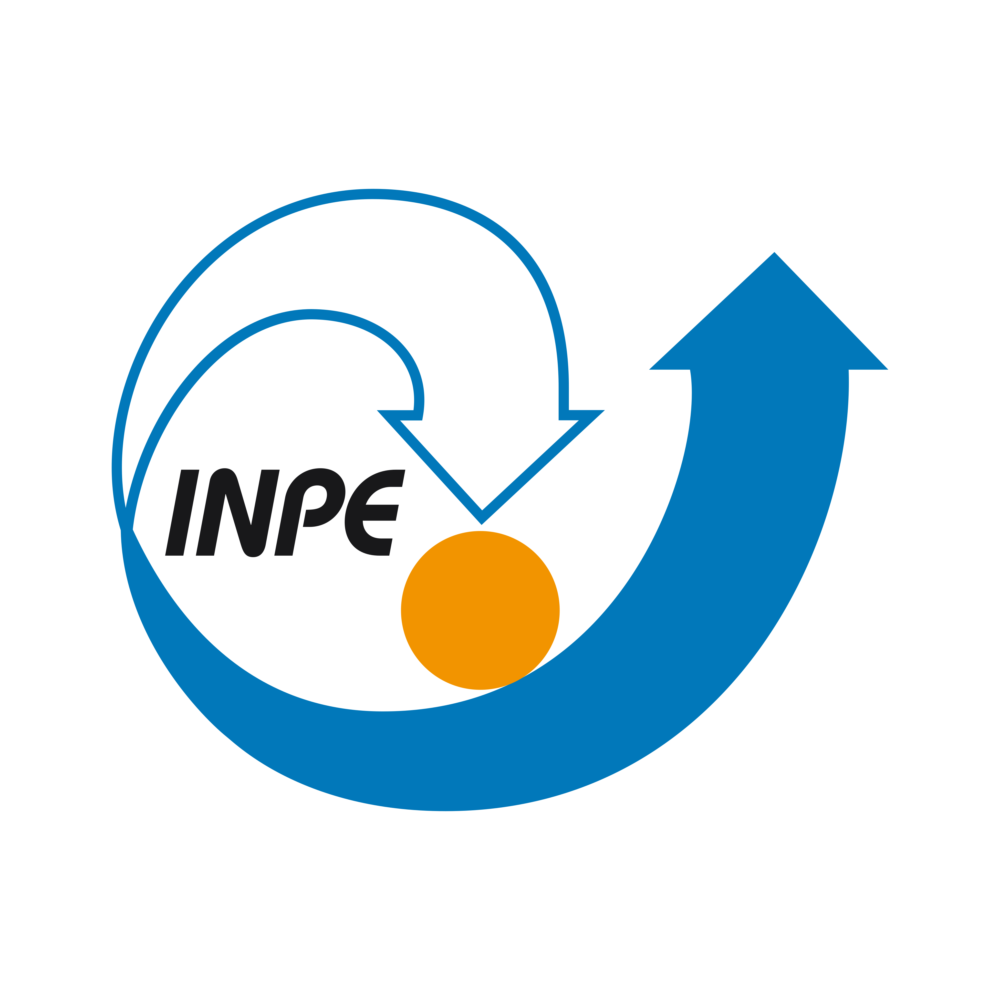

```{r setup, include=FALSE}
options(htmltools.dir.version = FALSE)
library(readr)
library(dplyr)
library(ggplot2)
dados_anuario <- read_delim("data/dados-anuario.csv",
                            delim = ";", escape_double = FALSE, trim_ws = TRUE)
```

---
background-image: url(img/CDnaEP_[VersaoHORIZONTAL-COR].png)
background-position: 50% 50%
class: center, bottom

#Coordenação:
## Karla Patrícia Oliveira Esquerre

---

class: center, middle

# Dados

### Fontes

---
class: inverse, center, middle

# O que é dado?

---
class: inverse, center, middle

# Quais estratégias vocês utilizam para coletar dados?


---
background-image: url(img/biker.png)
background-position: 50% 50%
class: center, bottom, inverse

# Se você não se equilibrar, os dados podem te derrubar!

---
background-image: url(img/farol.png) 
background-position: 25% 50%
class: center, bottom, inverse

# Meio Ambiente

---

# Vamos conhecer algumas fontes especiais de dados

Muitas fontes de dados não nos informam os metadados, o que atrasa na coleta 
dessas informações. Por isso, listamos um conjunto de dados qualificados 
que nos permitem dar rastreabilidade para a informação:

```{r, echo = FALSE, out.height="10%", fig.height=1, out.width="10%",fig.align='left'}


```

- [Sistema Nacional de Informações sobre o Saneamento](http://app4.mdr.gov.br/serieHistorica/);


```{r, echo = FALSE, out.height="10%", fig.height=1, out.width="10%",fig.align='left'}



```

- [Dados de Sensores Ambientais](http://sinda.crn.inpe.br/PCD/SITE/novo/site/historico/index.php)


```{r, echo = FALSE, out.height="10%", fig.height=1, out.width="10%",fig.align='left'}

knitr::include_graphics("img/logo-epe-site.png")

```

- [Dados de Energia Elétrica](https://www.epe.gov.br/sites-pt/publicacoes-dados-abertos/dados-abertos/Documents/dados-anuario.csv)

---
## O que podemos melhorar?


```{r echo=FALSE,eval=TRUE,tidy=FALSE,message=FALSE,warning=FALSE}
library(kableExtra)
library(formattable)
library(tibbletime)
library(readr)

dados_anuario <- read_delim("data/dados-anuario.csv", 
     delim = ";", escape_double = FALSE, col_types = cols(Data = col_date(format = "%Y%m%d"), 
       Consumo = col_number(), Consumidores = col_number()), 
     trim_ws = TRUE)

df<- dados_anuario %>% as_tbl_time(index = Data) %>% 
  filter_time(~'2019') %>% 
  filter(UF %in% c("BA")) %>% 
  select(SetorN1,Consumo) %>%
  group_by(SetorN1) %>%
  summarise(Consumo = sum(Consumo)/1e6) %>% arrange(desc(Consumo))
#df$Consumo <- digits(df$Consumo,digits = 0)

df %>% formattable()

#names(df) <- c("Setor N1", "Consumo (GWh)")

#df %>% formattable(align =c("l","r"),caption='Dados do Anuário Estatístico de Energia Elétrica',
                   #list(`Consumo (GWh)` = color_bar('#fed26e',proportion,0.5)))

```

---
## Empresa de Pesquisa Energética (EPE)

- Ano: 2019
- UF: BA
- Fonte: Empresa de Pesquisa Energética (EPE)

```{r echo=FALSE,eval=TRUE,tidy=FALSE,message=FALSE,warning=FALSE}
library(kableExtra)
library(formattable)
library(tibbletime)
library(readr)

dados_anuario <- read_delim("data/dados-anuario.csv", 
     delim = ";", escape_double = FALSE, col_types = cols(Data = col_date(format = "%Y%m%d"), 
       Consumo = col_number(), Consumidores = col_number()), 
     trim_ws = TRUE)

df<- dados_anuario %>% as_tbl_time(index = Data) %>% 
  filter_time(~'2019') %>% 
  filter(UF %in% c("BA")) %>% 
  select(SetorN1,Consumo) %>%
  group_by(SetorN1) %>%
  summarise(Consumo = sum(Consumo)/1e6) %>% arrange(desc(Consumo))
df$Consumo <- digits(df$Consumo,digits = 0)

names(df) <- c("Setor N1", "Consumo (GWh)")

df %>% formattable(align =c("l","r"),caption='Dados do Anuário Estatístico de Energia Elétrica',
                   list(`Consumo (GWh)` = color_bar('#fed26e',proportion,0.5)))

```

---
## Empresa de Pesquisa Energética (EPE)

- Ano: 2019
- UF: BA
- Fonte: Empresa de Pesquisa Energética (EPE)

```{r echo=FALSE,eval=TRUE,tidy=FALSE,message=FALSE,warning=FALSE}
library(tibbletime)
library(readr)
library(echarts4r)

dados_anuario <- read_delim("data/dados-anuario.csv", 
     delim = ";", escape_double = FALSE, col_types = cols(Data = col_date(format = "%Y%m%d"), 
       Consumo = col_number(), Consumidores = col_number()), 
     trim_ws = TRUE)

df<- dados_anuario %>% as_tbl_time(index = Data) %>% 
  filter_time(~'2019') %>% 
  filter(UF %in% c("BA")) %>% 
  select(SetorN1,Consumo) %>%
  group_by(SetorN1) %>%
  summarise(Consumo = sum(Consumo)/1e6) %>% arrange(desc(Consumo))
names(df) <- c("Setor N1", "Consumo (GWh)")

df  |> 
  head() |> 
  e_charts(`Setor N1`) |> 
  e_pie(`Consumo (GWh)`, radius = c("50%", "70%")) |> 
  e_title("Energia Elétrica - Bahia - 2019") |>
  e_legend(orient = 'vertical', 
           right = '5', top = '2%')


```


---
## O que há de estranho neste dados?

```{r echo=FALSE,eval=TRUE,tidy=FALSE,message=FALSE,warning=FALSE}

library(readr)
library(tidyverse)
library(lubridate)
library(ggplot2)
library(gganimate)
library(ggplotlyExtra)
library(plotly)
library(ggplotify)
library(dplyr)
library(units)

dados <- read_delim("data/32497_.csv",
                    ";", escape_double = FALSE, col_types =
                      cols(DataHora_GMT = col_datetime(format = "%Y-%m-%d %H:%M:%S"),
                           CorrPSol_Logico = col_integer()),
                    trim_ws = TRUE)


dados %>% mutate(ANO = year(DataHora_GMT)) %>%
#  filter(ANO>2000) %>%
  group_by(ANO) %>%
#  filter(hour(DataHora_GMT) %in% c(12)) %>%
  filter(!is.na(`RadSolAcum _Mjm-2`)) %>%
  ggplot(aes(x=DataHora_GMT,y=`RadSolAcum _Mjm-2`)) +
  #  geom_bar(stat = "identity",fill="#6cbfd3",color="#fac113") +
  geom_point(shape=18, fill="#6cbfd3", color="#6cbfd3", size=0.5)+
  labs(
    title = "Medição Irradiância Solar",
    x = "Dia",
    y = parse(text = "`I`~~ group('[', kWh * m^-2, ']')")
  ) +
  theme(title = element_text(size = 18,colour = "#db4470"))+
  theme(axis.title.x=element_text(size=16)) +
  theme(axis.title.y=element_text(size=16)) +
  theme(legend.text=element_text(size =16)) +
  theme(axis.text=element_text(size =16))  +
  theme(legend.position = "none")+
  theme(panel.grid = element_blank(), axis.ticks.y = element_line())+
  #  theme( axis.line = element_line(colour = "darkblue",
  #                      size = 1, linetype = "solid"))+
  theme(panel.border = element_rect(fill=NA, color = "#64D2AA", size = 2))+
  theme(panel.background = element_rect(fill=NA,color = "gray70", size = 2),
        panel.grid.major = element_line(color = "gray70", size = .5),
        panel.grid.minor = element_line(color = "gray70", size = .25))+
  # scale_x_continuous(breaks = seq(2009, 2018, by = 1))+
  theme(axis.text.x = element_text(angle = 25, vjust = 1.0, hjust = 1.0))
#+
 # facet_wrap(~ANO,ncol = 3)


```
---
## Vamos enxergar mais de perto?

```{r echo=FALSE,eval=TRUE,tidy=FALSE,message=FALSE,warning=FALSE}

library(readr)
library(tidyverse)
library(lubridate)
library(ggplot2)
library(gganimate)
library(ggplotlyExtra)
library(plotly)
library(ggplotify)
library(dplyr)
library(units)

dados %>% mutate(ANO = year(DataHora_GMT)) %>%
  filter(ANO>2000) %>%
  group_by(ANO) %>%
#  filter(hour(DataHora_GMT) %in% c(12)) %>%
  filter(!is.na(`RadSolAcum _Mjm-2`)) %>%
  ggplot(aes(x=DataHora_GMT,y=`RadSolAcum _Mjm-2`)) +
  #  geom_bar(stat = "identity",fill="#6cbfd3",color="#fac113") +
  geom_point(shape=18, fill="#6cbfd3", color="#6cbfd3", size=0.5)+
  labs(
    title = "Medição Irradiância Solar",
    x = "Dia",
    y = parse(text = "`I`~~ group('[', kWh * m^-2, ']')")
  ) +
  theme(title = element_text(size = 18,colour = "#db4470"))+
  theme(axis.title.x=element_text(size=16)) +
  theme(axis.title.y=element_text(size=16)) +
  theme(legend.text=element_text(size =16)) +
  theme(axis.text=element_text(size =16))  +
  theme(legend.position = "none")+
  theme(panel.grid = element_blank(), axis.ticks.y = element_line())+
  #  theme( axis.line = element_line(colour = "darkblue",
  #                      size = 1, linetype = "solid"))+
  theme(panel.border = element_rect(fill=NA, color = "#64D2AA", size = 2))+
  theme(panel.background = element_rect(fill=NA,color = "gray70", size = 2),
        panel.grid.major = element_line(color = "gray70", size = .5),
        panel.grid.minor = element_line(color = "gray70", size = .25))+
  # scale_x_continuous(breaks = seq(2009, 2018, by = 1))+
  theme(axis.text.x = element_text(angle = 25, vjust = 1.0, hjust = 1.0))+
  facet_wrap(~ANO,ncol = 3)
```
---
## E se observamos apenas os valores para 12h?

```{r echo=FALSE,eval=TRUE,tidy=FALSE,message=FALSE,warning=FALSE}
dados %>% mutate(ANO = year(DataHora_GMT)) %>%
  filter(ANO>2000) %>%
  group_by(ANO) %>%
  filter(hour(DataHora_GMT) %in% c(12)) %>%
  filter(!is.na(`RadSolAcum _Mjm-2`)) %>%
  ggplot(aes(x=DataHora_GMT,y=`RadSolAcum _Mjm-2`)) +
  #  geom_bar(stat = "identity",fill="#6cbfd3",color="#fac113") +
  geom_point(shape=18, fill="#6cbfd3", color="#6cbfd3", size=0.5)+
  labs(
    title = "Medição Irradiância Solar 12:00",
    x = "Dia",
    y = parse(text = "`I`~~ group('[', kWh * m^-2, ']')")
  ) +
  theme(title = element_text(size = 18,colour = "#db4470"))+
  theme(axis.title.x=element_text(size=16)) +
  theme(axis.title.y=element_text(size=16)) +
  theme(legend.text=element_text(size =16)) +
  theme(axis.text=element_text(size =16))  +
  theme(legend.position = "none")+
  theme(panel.grid = element_blank(), axis.ticks.y = element_line())+
  #  theme( axis.line = element_line(colour = "darkblue",
  #                      size = 1, linetype = "solid"))+
  theme(panel.border = element_rect(fill=NA, color = "#64D2AA", size = 2))+
  theme(panel.background = element_rect(fill=NA,color = "gray70", size = 2),
        panel.grid.major = element_line(color = "gray70", size = .5),
        panel.grid.minor = element_line(color = "gray70", size = .25))+
  # scale_x_continuous(breaks = seq(2009, 2018, by = 1))+
  theme(axis.text.x = element_text(angle = 25, vjust = 1.0, hjust = 1.0))+
  facet_wrap(~ANO,ncol = 3)
```

---
## Vamos avaliar apenas entre 2005 e 2009?

```{r echo=FALSE,eval=TRUE,tidy=FALSE,message=FALSE,warning=FALSE}

dados %>% mutate(ANO = year(DataHora_GMT)) %>%
  filter(ANO>2005 & ANO<2009) %>%
  group_by(ANO) %>%
  filter(hour(DataHora_GMT) %in% c(12)) %>%
  filter(!is.na(`RadSolAcum _Mjm-2`)) %>%
  ggplot(aes(x=DataHora_GMT,y=`RadSolAcum _Mjm-2`)) +
  #  geom_bar(stat = "identity",fill="#6cbfd3",color="#fac113") +
  geom_point(shape=18, fill="#6cbfd3", color="#6cbfd3", size=0.5)+
  labs(
    title = "Medição Irradiância Solar 12:00",
    x = "Dia",
    y = parse(text = "`I`~~ group('[', kWh * m^-2, ']')")
  ) +
  theme(title = element_text(size = 18,colour = "#db4470"))+
  theme(axis.title.x=element_text(size=16)) +
  theme(axis.title.y=element_text(size=16)) +
  theme(legend.text=element_text(size =16)) +
  theme(axis.text=element_text(size =16))  +
  theme(legend.position = "none")+
  theme(panel.grid = element_blank(), axis.ticks.y = element_line())+
  #  theme( axis.line = element_line(colour = "darkblue",
  #                      size = 1, linetype = "solid"))+
  theme(panel.border = element_rect(fill=NA, color = "#64D2AA", size = 2))+
  theme(panel.background = element_rect(fill=NA,color = "gray70", size = 2),
        panel.grid.major = element_line(color = "gray70", size = .5),
        panel.grid.minor = element_line(color = "gray70", size = .25))+
  # scale_x_continuous(breaks = seq(2009, 2018, by = 1))+
  theme(axis.text.x = element_text(angle = 25, vjust = 1.0, hjust = 1.0))+
  facet_wrap(~ANO,ncol = 1)
```

---
## Se há algo estranho é preciso observar 12, 15 e 18h! 

```{r echo=FALSE,eval=TRUE,tidy=FALSE,message=FALSE,warning=FALSE}

dados %>% mutate(ANO = year(DataHora_GMT)) %>%
  mutate(hora = hour(DataHora_GMT)) %>%
  filter(ANO %in% c(2008)) %>%
  group_by(hora) %>%
  filter(hour(DataHora_GMT) %in% c(12,15,18)) %>%
  filter(!is.na(`RadSolAcum _Mjm-2`)) %>%
  ggplot(aes(x=DataHora_GMT,y=`RadSolAcum _Mjm-2`,color=hora)) +
  #  geom_bar(stat = "identity",fill="#6cbfd3",color="#fac113") +
  #geom_point(shape=18, fill="#fac113", color="#fac113", size=2)+
  geom_point(size=2)+
  labs(
    title = "Medição Irradiância Solar (2008)",
    x = "Dia",
    y = parse(text = "`I`~~ group('[', kWh * m^-2, ']')")
  ) +
  theme(title = element_text(size = 18,colour = "#db4470"))+
  theme(axis.title.x=element_text(size=16)) +
  theme(axis.title.y=element_text(size=16)) +
  theme(legend.text=element_text(size =14)) +
  theme(axis.text=element_text(size =14))  +
#  theme(legend.position = "none")+
  theme(panel.grid = element_blank(), axis.ticks.y = element_line())+
  #  theme( axis.line = element_line(colour = "darkblue",
  #                      size = 1, linetype = "solid"))+
  theme(panel.border = element_rect(fill=NA, color = "#64D2AA", size = 2))+
  theme(panel.background = element_rect(fill=NA,color = "gray90", size = 2),
        panel.grid.major = element_line(color = "gray90", size = .5),
        panel.grid.minor = element_line(color = "gray90", size = .25))+
  # scale_x_continuous(breaks = seq(2009, 2018, by = 1))+
  theme(axis.text.x = element_text(angle = 25, vjust = 1.0, hjust = 1.0)) #+
  #facet_wrap(~hora,ncol = 4)
```

---


background-image: url(img/Hospital.png) 
background-position: 25% 50%
class: center, bottom

# Saúde


---
background-image: url(img/pessoas.png) 
background-position: 50% 50%
class: center, bottom, inverse

# População


---
## População de Salvador/BA


```{r,echo=FALSE,out.width = "400px"}
knitr::include_graphics("img/construtura_carioca_cn_1930_v04.png")
```

---
## Exemplo - Codigo para Sidrar

```{r comment='#',eval=FALSE,echo=TRUE}
# Instalacao
library(sidrar)
lista <- search_sidra("casamento")
## Depois de rodar o código acima pode optar por uma das tabelas por exemplo:
sidrar::get_sidra(350,geo = "City",geo.filter = 2927408)

```
---
## Geobr

```{r eval=FALSE,echo=TRUE,tidy=FALSE,message=FALSE,warning=FALSE}
#devtools::install_github("ipeaGIT/geobr", subdir = "r-package")
# Instalacao
library(geobr)
library(sidrar)
library(sf)
library(dplyr)
library(ggplot2)

#lista <- search_sidra("casamento")
## Depois de rodar o código acima pode optar por uma das tabelas por exemplo:
dadocasamentos <- sidrar::get_sidra(350,geo = "City",geo.filter = 2927408)

dados_total<-dadocasamentos %>% filter(`Grupo de idade da mulher (Código)` %in% c(0)) %>%
                                filter(`Grupo de idade do homem (Código)` %in% c(0)) %>%   
                                filter(Ano %in% c("2002")) %>%
                                select(`Município (Código)`,Valor) %>% 
                                summarise(`Município (Código)`=as.double(`Município (Código)`),Valor)

mapa <- read_municipality(code_muni=2927408, year=2020)

dataset_final = left_join(mapa, dados_total, by=c("code_muni"="Município (Código)"))

ggplot() +
  geom_sf(data=dataset_final, aes(fill=Valor), color= NA, size=.15)+
  labs(title="Número total de casamentos em Salvador",
       caption='Fonte: Elaboração própria', size=8)+
  scale_fill_distiller(palette = "Greens", limits=c(1000, 10000),
                       name="Code_muni")+
  theme_minimal()


```


---
background-image: url(img/tribunal_justica.png) 
background-position: 50% 50%
class: center, bottom, inverse

# Justiça

---

```{r , echo = FALSE, eval=TRUE }

library(readr)
dados_viol_sex_bahia_raca_cor <- read_delim("data/dados_viol_sex_bahia_raca_cor.csv", 
     ",", escape_double = FALSE, col_types = cols(ano = col_character(), 
         ignorado = col_integer(), nao_negras = col_integer(), 
         negras = col_integer(), total = col_integer()), 
     trim_ws = TRUE)

knitr::kable(head(dados_viol_sex_bahia_raca_cor,10),caption = "Número de mulheres vítimas de violência sexual na Bahia", format = 'html')
```
**Fonte:** Rede Observatórios de Segurança Pública. [A cor da violência na Bahia - Uma análise dos homicídios e violência sexual na última década](http://observatorioseguranca.com.br/wp-content/uploads/2020/03/A-cor-da-viole%CC%82ncia-na-Bahia-Uma-ana%CC%81lise-dos-homici%CC%81dios-e-viole%CC%82ncia-sexual-na-u%CC%81ltima-de%CC%81cada-FINAL.pdf) 

---
### Número de mulheres vítimas de violência sexual na Bahia

```{r , echo = FALSE, eval=TRUE}
library(readr)
library(ggplot2)
library(dplyr)
library(echarts4r) 

dados_viol_sex_bahia_raca_cor <- read_delim("data/dados_viol_sex_bahia_raca_cor.csv", 
     ",", escape_double = FALSE, col_types = cols(ano = col_character(), 
         ignorado = col_integer(), nao_negras = col_integer(), 
         negras = col_integer(), total = col_integer()), 
     trim_ws = TRUE)

  dados_viol_sex_bahia_raca_cor %>% 
  e_charts(ano) %>% 
  e_bar(total, stack = "grp")
```

**Fonte:** Rede Observatórios de Segurança Pública. [A cor da violência na Bahia - Uma análise dos homicídios e violência sexual na última década](http://observatorioseguranca.com.br/wp-content/uploads/2020/03/A-cor-da-viole%CC%82ncia-na-Bahia-Uma-ana%CC%81lise-dos-homici%CC%81dios-e-viole%CC%82ncia-sexual-na-u%CC%81ltima-de%CC%81cada-FINAL.pdf) 

---
### Número de mulheres vítimas de violência sexual na Bahia

```{r , echo = FALSE, eval=TRUE}
library(readr)
library(ggplot2)
library(dplyr)
library(echarts4r) 

dados_viol_sex_bahia_raca_cor <- read_delim("data/dados_viol_sex_bahia_raca_cor.csv", 
     ",", escape_double = FALSE, col_types = cols(ano = col_character(), 
         ignorado = col_integer(), nao_negras = col_integer(), 
         negras = col_integer(), total = col_integer()), 
     trim_ws = TRUE)

  dados_viol_sex_bahia_raca_cor %>% 
  e_charts(ano) %>% 
  e_bar(negras, stack = "grp") %>% 
  e_bar(nao_negras, stack = "grp") %>% 
  e_bar(ignorado, stack = "grp") %>%
     e_tooltip(trigger = "item")
  
```

  **Fonte:** Rede Observatórios de Segurança Pública. [A cor da violência na Bahia - Uma análise dos homicídios e violência sexual na última década](http://observatorioseguranca.com.br/wp-content/uploads/2020/03/A-cor-da-viole%CC%82ncia-na-Bahia-Uma-ana%CC%81lise-dos-homici%CC%81dios-e-viole%CC%82ncia-sexual-na-u%CC%81ltima-de%CC%81cada-FINAL.pdf) 
---
### Número de mulheres vítimas de violência sexual na Bahia

```{r , echo = FALSE, eval=TRUE}
library(readr)
library(ggplot2)
library(dplyr)
library(echarts4r) 
library(tidyr)

dados_viol_sex_bahia_raca_cor <- read_delim("data/dados_viol_sex_bahia_raca_cor.csv", 
     ",", escape_double = FALSE, col_types = cols(ano = col_character(), 
         ignorado = col_double(), nao_negras = col_double(), 
         negras = col_double(), total = col_double()), 
     trim_ws = TRUE)

dados_viol_sex_bahia_raca_cor %>% 
  gather(key = "categorias",value = "ocorrencias",-ano) %>% 
  group_by(categorias) %>%
  e_charts() %>% 
  e_boxplot(ocorrencias) %>%
  e_tooltip(trigger = "item") %>%
  e_toolbox_feature(feature = "dataZoom")

```

**Fonte:** Rede Observatórios de Segurança Pública. [A cor da violência na Bahia - Uma análise dos homicídios e violência sexual na última década](http://observatorioseguranca.com.br/wp-content/uploads/2020/03/A-cor-da-viole%CC%82ncia-na-Bahia-Uma-ana%CC%81lise-dos-homici%CC%81dios-e-viole%CC%82ncia-sexual-na-u%CC%81ltima-de%CC%81cada-FINAL.pdf)   

---
## Exemplo de dashboard externo - Mapa

1. [App Segurança Pública](https://robsonpessoa.shinyapps.io/ssp_indicadores/)

---
# Engajamentos, Eventos e Difusão 

0. [Base dos dados](basedosdados.org)
1. [Open Data Day](https://opendataday.org/pt_br/)
2. [SER VI](http://ser.uff.br/)
3. [LGPD](https://youtu.be/d9BoYJaYSRk)
4. [Dado, Conhecimento e Informação](https://soundcloud.com/grupometropole/19-10-20-comentario-andre-lemos-informacao-dado-e-conhecimento?ref=clipboard&p=i&c=0)
5. [Beatriz Milz](https://github.com/beatrizmilz)
6. [Ícaro Bernardes](https://github.com/IcaroBernardes)
